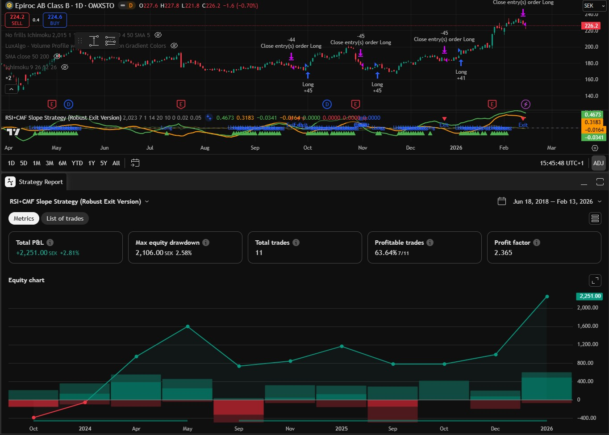

# CMF- and RSI-slope strategy for Trading View
A TradingView long strategy made with PineScript

## Overview

* **Entry**: Buy when both Smoothed Normalized RSI and Smoothed Normalized CMF have a positive upward slope (slope > configurable threshold, default 0).
* **Exit Condition 1**: Sell when both RSI and CMF have a negative downward slope (slope < negative configurable threshold, default 0).
* **Exit Condition 2 (Crash)**: Sell when RSI crosses below CMF **AND** RSI has a sharp downward slope (slope < negative crash threshold).
* **Configuration**: RSI and CMF lengths, smoothing length (EMA), start date, and slope thresholds are all configurable.

## Updates

- 2026-02-15: Created project. Vibe coded with Chatgpt, Gemini and Claude Sonnet 4.
